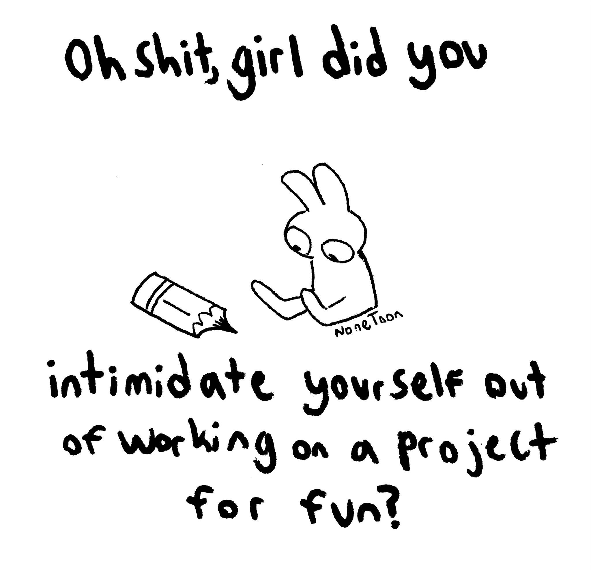

I've spent too much time thinking about the perfect way to set up my homepage, all the cool things I want to build, and then I get overwhelmed and never do it. So I'm keeping it simple this time.

I want to explore creativity and the old web. I want to create a place to express myself and dive deep into topics that interest me. Sometimes, I also want to talk about non-web-related topics.

I have a lot of big projects I want to work on, that I want to build in order to improve the digital landscape in tiny ways. This will also be a house for that.

